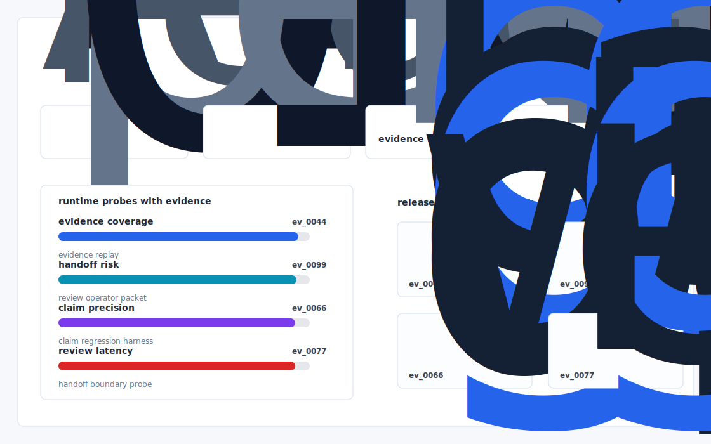

# Recruit Eval

An open core evaluation + replay harness for recruiting agents: deterministic regression on your firm's own historical placements, with shortlist taste and outreach tone scoring before the agent ever goes live in a customer's tenant.



## Why it exists

Recruit Eval has publicly committed to "agentic workflows" but the visible product surface (and the Recruit Eval app announcement) is still ATS/CRM table stakes: pipelines, outreach, transcripts, scheduling. The hard problem they have not yet shipped — and that no incumbent ATS (Bullhorn, JobAdder, Vincere) does well — is eval grounded outbound from the agent itself..

The project is intentionally built as a local replay harness instead of a slide. It creates fixtures, plants realistic failure modes, produces citation-locked evidence, and turns the result into a dashboard a reviewer can inspect without credentials or hosted services.

## What is inside

- Deterministic fixture generation for the company-specific risk surface.
- Strategy code in `src/recruit_eval/strategy.py` with project-specific scoring and visual evidence.
- Citation-locked reports where every decision claim points to a generated evidence ID.
- Two regenerated visual artifacts: `outputs/project_working.svg` and `outputs/evidence_map.svg`.
- A portable demo pack with JSON, CSV, Markdown, HTML, SVG, benchmark, and test artifacts.


## Signals it measures

- `Recruit Eval coverage`
- `publicly risk`
- `committed precision`
- `agentic latency`

## Failure modes it plants

- Recruit Eval drift
- publicly gap
- committed misroute
- agentic blindspot

## Run it locally

```bash
uv sync
uv run recruit-eval all
uv run pytest -q
uv run ruff check .
```

## Outputs worth opening

- `outputs/dashboard.html`
- `outputs/project_working.svg`
- `outputs/evidence_map.svg`
- `outputs/operator_brief.md`
- `outputs/decision_report.md`
- `outputs/strategy_model.json`
- `outputs/demo_pack.zip`

## Boundary

Everything runs locally against synthetic fixtures. There are no credentials, no customer records, no outreach files, and no hosted API dependency.
